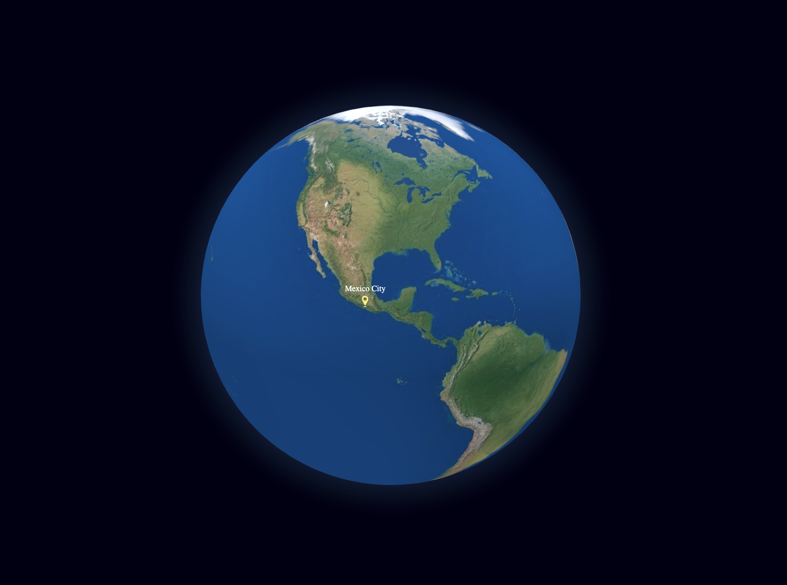

# 🌍 Earth Globe with Markers (Globe.gl)

This project displays an interactive 3D Earth globe with markers using [Globe.gl](https://github.com/vasturiano/globe.gl).

🔗 **Live Demo:** [View it here](https://subtle-basbousa-dede1f.netlify.app/)